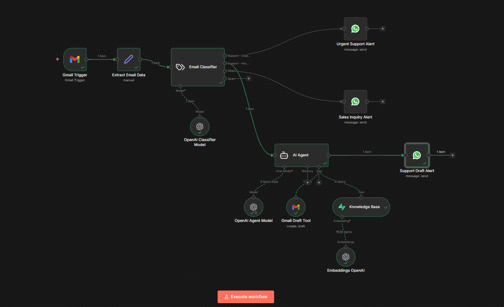
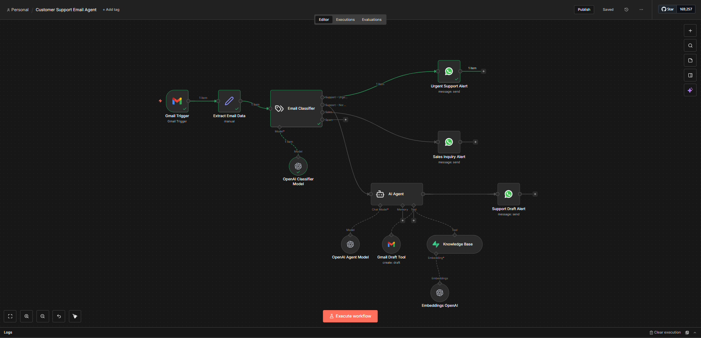
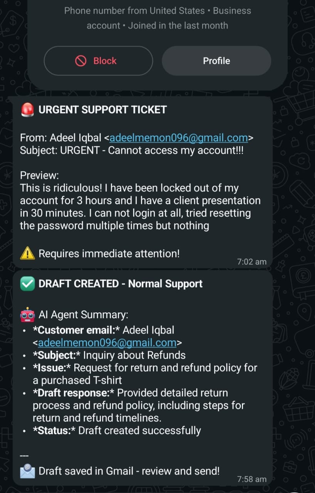

# AI Email Support Agent 🤖📧

> An intelligent customer support agent that classifies, routes, and responds to customer support emails using GPT-4o, vector search, and WhatsApp notifications - reducing response time by 80%.

---

## 📋 Table of Contents

- [Overview](#overview)
- [Key Features](#key-features)
- [How It Works](#how-it-works)
- [Technology Stack](#technology-stack)
- [Workflow Architecture](#workflow-architecture)
- [Results & Benefits](#results--benefits)
- [Screenshots](#screenshots)
- [Get This Solution](#get-this-solution)

---

## 🎯 Overview

This AI-powered email support agent automates customer service workflows by intelligently classifying incoming emails, searching company knowledge bases, and generating professional responses - all without human intervention for routine inquiries.

**Perfect for:**
- E-commerce businesses handling high email volumes
- SaaS companies with 24/7 support needs
- Startups looking to scale support without hiring
- Any business wanting faster, consistent customer responses

---

## ✨ Key Features

### 🧠 **Intelligent Email Classification**
- Automatically categorizes emails into 4 types:
  - **Support - Urgent** (Critical issues, angry customers)
  - **Support - Normal** (General inquiries, how-to questions)
  - **Sales** (Pre-sales inquiries, demos)
  - **Spam** (Filtered out automatically)

### 🔍 **AI-Powered Knowledge Search**
- Searches company FAQs, policies, and product documentation
- Uses vector embeddings (Supabase) for semantic search
- Retrieves most relevant information for accurate responses

### ✍️ **Automated Draft Generation**
- Creates professional, contextual email responses
- Maintains brand voice and tone
- Includes proper greeting, solution, and sign-off
- Ready for quick review and send

### 📱 **Real-Time WhatsApp Alerts**
- Urgent issues: Immediate alert with email preview
- Normal support: Notification when draft is ready
- Sales inquiries: Instant notification for follow-up
- Never miss important customer communications

### ⚙️ **Smart Routing**
- Critical/angry emails → Direct human escalation
- Routine questions → AI handles with draft
- Sales leads → Immediate team notification
- Spam → Auto-filtered

---

## 🛠️ Technology Stack

| Component | Technology | Purpose |
|-----------|-----------|---------|
| **Workflow Engine** | n8n | Visual automation platform |
| **AI Models** | GPT-4o, GPT-4o-mini | Classification & response generation |
| **Vector Database** | Supabase (pgvector) | Knowledge base search |
| **Email** | Gmail API | Trigger & draft creation |
| **Notifications** | WhatsApp Business API | Real-time alerts |
| **Embeddings** | OpenAI text-embedding-3 | Semantic search |

---

## 🏗️ Workflow Architecture

### Nodes Overview

1. **Gmail Trigger** - Monitors inbox every minute
2. **Extract Email Data** - Parses email content and metadata
3. **Email Classifier** - AI categorizes email type
4. **Route Logic** - Directs to appropriate handler
5. **AI Agent** - Searches KB and generates response
6. **Gmail Draft Tool** - Creates draft in Gmail
7. **WhatsApp Alerts** - Sends notifications

### AI Agent Components

- **System Prompt** - Defines role, rules, and workflow
- **Knowledge Base Tool** - Searches Supabase vector store
- **Gmail Tool** - Creates draft responses
- **Context Awareness** - Uses email metadata for personalization

*Complete n8n workflow showing all nodes and connections*

---

## 📊 Results & Benefits

### Time Savings
- **80% faster** response time for routine inquiries
- **90% reduction** in manual email sorting
- **24/7 availability** without additional staff

### Cost Efficiency
- Reduces need for large support teams
- Handles unlimited email volume at fixed cost
- Scales without linear cost increase

### Quality Improvements
- Consistent, professional responses
- Zero missed urgent issues
- Knowledge base ensures accuracy
- Brand voice maintained

### Team Benefits
- Focus on complex issues only
- Real-time escalation alerts
- Complete audit trail
- Easy draft review and edit

---

## 📸 Screenshots

### Workflow Overview

*Detailed view of automation nodes and connections*

### WhatsApp Alerts in Action

*Real-time alerts for urgent, normal, and sales emails*

---

## 🤝 Get This Solution

### 🎯 Need This for Your Business?

I build custom AI automation solutions for businesses looking to scale their operations intelligently.

**What I Offer:**
- ✅ Full implementation and setup
- ✅ Custom knowledge base integration
- ✅ Tailored email categorization
- ✅ Brand voice training
- ✅ Ongoing support and optimization
- ✅ Training for your team

**Pricing:**
- **Ready-to-Deploy Package:** Complete setup with your data
- **Custom Development:** Tailored to your specific workflows
- **Enterprise Solutions:** Multi-channel, advanced features

### 📞 Contact Me

**Adeel Iqbal Memon**

- 📧 Email: [adeelmemon096@yahoo.com](mailto:adeelmemon096@yahoo.com)
- 💬 WhatsApp: [+92 314 7116890](https://wa.me/923147116890)
- 💼 LinkedIn: [linkedin.com/in/adeeliqbalmemon](https://linkedin.com/in/adeeliqbalmemon)
- 🐙 GitHub: [github.com/adeel-iqbal](https://github.com/adeel-iqbal)

**Let's discuss how this solution can transform your customer support!**

---

## 🙏 Acknowledgments

- Built with [n8n](https://n8n.io) - Fair-code workflow automation
- Powered by [OpenAI](https://openai.com) GPT-4o models
- Vector search by [Supabase](https://supabase.com)

---

## 🌟 Star This Repo

If you find this project useful, please consider giving it a ⭐ on GitHub!

---

**Built with ❤️ by [Adeel Iqbal Memon](https://github.com/adeel-iqbal)**

*Transforming customer support with AI automation*

